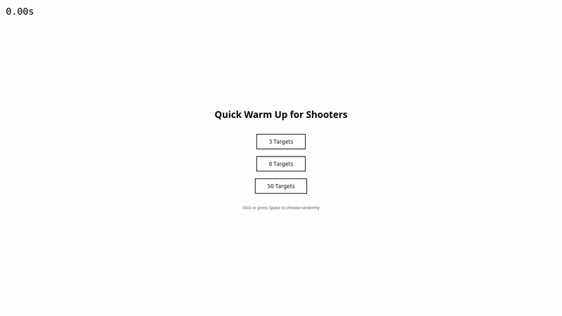

# Aim trainer for shooters, (in ThreeJS)
<h3 align="center">🎮 Game Preview</h3>

<p align="center">
  
</p>

## How to install

```bash
npm install
```

## How to run

```bash
npm run dev
```

## How to build

```bash
npm run build
```

## How to preview

```bash
npm run preview
```

---

## 🎮 Gameplay & Controls

| Action | Key/Mouse |
|--------|-----------|
| Move Forward / Back | `W` / `S` |
| Strafe Left / Right | `A` / `D` |
| Shoot                | `Left Click` |
| Crouch               | `C` (hold) |
| Jump                 | `Space` |
| Lock Pointer         | `Click` inside canvas |
| Start Round          | `Space` |

Use the **sensitivity slider** in the start screen to fine-tune mouse sensitivity. The value is stored in `localStorage` so your preference persists across sessions.

## ✨ Features

* Three target presets (3, 8, 50) for quick warm-ups.
* Procedurally generated colored cubes that become shootable one at a time.
* Animated target absorption effect when hit.
* Die-cut cell-shaded pistol model that follows camera rotation.
* FPS-style WASD movement with adjustable sensitivity and inertia.
* Built-in timer that stops automatically when the last target disappears.
* Post-processing pipeline (`EffectComposer`, FXAA pass) ready for expansion.
* Fully written in **TypeScript** + **Three.js** and bundled with **Vite**.

## 🗂️ Project Structure

```text
three-shooter/
├── public/               # Static assets (models, textures, icons…)
├── src/
│   ├── core/             # Engine wrappers (Camera, Renderer, Loop, App)
│   ├── objects/          # 3D objects & generators (Cube, Pistol …)
│   ├── scenes/           # Three.js scenes (MainScene)
│   ├── systems/          # Behaviour modules (ControlsWithMovement)
│   ├── ui/               # DOM-based UI overlays (StartScreen)
│   └── main.ts           # Vite entry point
├── index.html            # Game container & UI markup
├── package.json          # NPM scripts & deps
└── tsconfig.json         # TypeScript configuration
```

## 🛠️ Tech Stack

* **Three.js** – WebGL abstraction layer for 3D rendering.
* **TypeScript** – Static typing for safer code.
* **Vite** – Lightning-fast dev server & bundler.
* **Post-processing Addons** – `EffectComposer`, `RenderPass`, `FXAAShader`.

## 🔧 Configuration

| Option | Location | Description |
|--------|----------|-------------|
| Mouse sensitivity | `localStorage` key `mouseSensitivity` | Set via slider on start screen. Multiplies base rotation speed. |
| Renderer quality  | `src/core/Renderer.ts` | Change antialias, pixel ratio, post FX. |
| Target counts     | `src/scenes/MainScene.ts` | `level1/2/3()` generate different numbers of cubes. |

## 📜 Available NPM Scripts

| Script | Purpose |
|--------|---------|
| `npm run dev`      | Local dev server on `localhost:5173`. |
| `npm run build`    | Production build to `dist/`. |
| `npm run preview`  | Preview the production build locally. |

## 📦 Assets

* `public/models/pistol.glb` – Low-poly pistol model.
* `preview.gif` – Gameplay preview used in this README.
* `controls.png` – Legend for keyboard controls shown in HUD.

## 🚀 Deployment

The final build is static and can be deployed to any static host (Netlify, GitHub Pages, Vercel…).

```bash
npm run build
# copy dist/ to your preferred host
```

## 👤 Author

*Freddy Sae*

Feel free to open issues or PRs!

## 📝 License

This project is released under the **MIT License** – see [`LICENSE`](LICENSE) for details.

